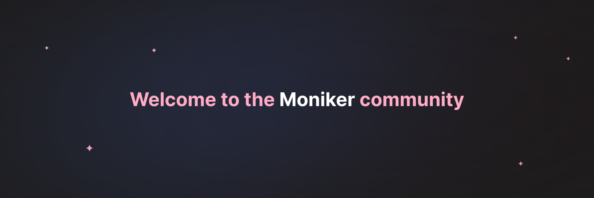

# [Moniker](https://mnkr.cc)

Welcome to the official GitHub repository of [Moniker](https://mnkr.cc)! Your one-stop destination to seamlessly link and showcase all your online presences.

## 🌐 What is [Moniker](https://mnkr.cc)?

[Moniker](https://mnkr.cc) is a unique online platform designed to centralize your digital identity. Here's what you can do with us:

- **Unified Social Presence**: Link all your social media profiles in one place.
- **Spotify Integration**: Show others what you're listening to in real-time.
- **Email Address**: Get your personalized email with an `@mnkr.cc` domain, adding a touch of professionalism to your digital identity.

...and a lot more
